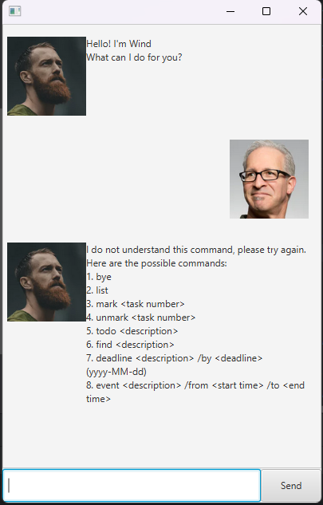

# Wind User Guide

Wind is a desktop task management application that helps you keep track of your todos, deadlines, and events through a Command Line Interface (CLI). With Wind, you can efficiently manage your tasks using simple text commands.



## Quick Start

1. Ensure you have Java 11 or above installed on your computer
2. Download the latest version of Wind from [here]
3. Copy the downloaded file to a folder you want to use as the home folder for Wind
4. Double-click the file to start the application. The GUI should appear in a few seconds:

## Features

### Notes about the command format:
- Commands are case-sensitive
- Parameters should be provided in the order specified
- Items in `UPPER_CASE` are the parameters to be supplied by the user
- Extra spaces between parameters are allowed

### Viewing task list : `list`
Shows a list of all tasks you have added.

Format: `list`

Expected output:
```
Here are the tasks in your list:
1.[T][X] read book
2.[D][ ] return book (by: Sunday)
3.[E][ ] project meeting (at: Mon 2-4pm)
```

### Adding a todo task : `todo`
Adds a todo task to the task list.

Format: `todo TASK_DESCRIPTION`

Example: `todo read book`

Expected output:
```
Got it. I've added this task:
  [T][ ] read book
Now you have 1 tasks in the list.
```

### Adding a deadline task : `deadline`
Adds a task with a deadline to the task list.

Format: `deadline TASK_DESCRIPTION /by DEADLINE`

Example: `deadline return book /by Sunday`

Expected output:
```
Got it. I've added this task:
  [D][ ] return book (by: Sunday)
Now you have 2 tasks in the list.
```

### Adding an event : `event`
Adds an event task with a specific time/date to the task list.

Format: `event TASK_DESCRIPTION /at TIME`

Example: `event project meeting /at Mon 2-4pm`

Expected output:
```
Got it. I've added this task:
  [E][ ] project meeting (at: Mon 2-4pm)
Now you have 3 tasks in the list.
```

### Finding tasks : `find`
Finds tasks whose descriptions contain the given keyword.

Format: `find KEYWORD`

Example: `find book`

Expected output:
```
Here are the matching tasks in your list:
1.[T][X] read book
2.[D][ ] return book (by: Sunday)
```

### Marking a task as done : `mark`
Marks a task as completed.

Format: `mark TASK_NUMBER`

Example: `mark 1`

Expected output:
```
OK, I've marked this task as done:
  [T][X] read book
```

### Unmarking a task : `unmark`
Marks a completed task as not done.

Format: `unmark TASK_NUMBER`

Example: `unmark 1`

Expected output:
```
OK, I've marked this task as not done yet:
  [T][ ] read book
```

### Deleting a task : `delete`
Removes a task from the task list.

Format: `delete TASK_NUMBER`

Example: `delete 2`

Expected output:
```
Noted. I've removed this task:
  [D][ ] return book (by: Sunday)
Now you have 2 tasks in the list.
```

### Exiting the program : `bye`
Saves all tasks and exits the program.

Format: `bye`

Expected output:
```
Bye. Hope to see you again soon!
```

## Command Summary

| Action | Format | Example |
|--------|---------|---------|
| List | `list` | `list` |
| Todo | `todo TASK_DESCRIPTION` | `todo read book` |
| Deadline | `deadline TASK_DESCRIPTION /by DEADLINE` | `deadline return book /by Sunday` |
| Event | `event TASK_DESCRIPTION /at TIME` | `event project meeting /at Mon 2-4pm` |
| Find | `find KEYWORD` | `find book` |
| Mark | `mark TASK_NUMBER` | `mark 1` |
| Unmark | `unmark TASK_NUMBER` | `unmark 1` |
| Delete | `delete TASK_NUMBER` | `delete 2` |
| Exit | `bye` | `bye` |
